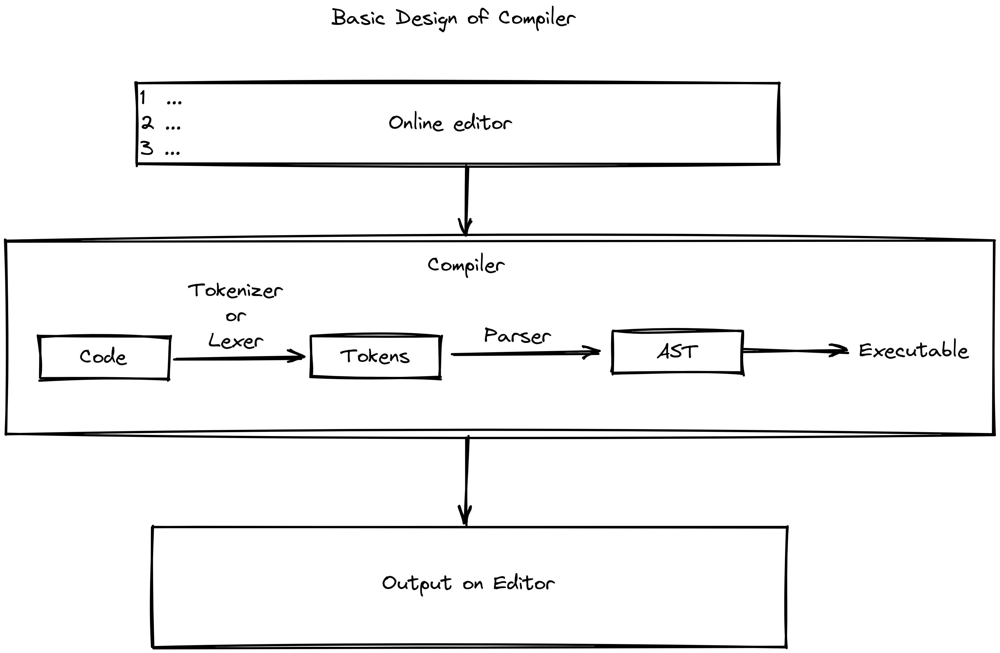

## VMware Campus Ambassador Program Hackathon

### Summary

| Team Name    | Angry Coders                                  |
| ------------ | --------------------------------------------- |
| Members      | Arpit Bhalla, Kunal Dhiman                    |
| Category     | App Modernization                             |
| Topic        | Developing online compiler                    |
|Tech Stack | Typescript + Web Assemobly 
| College Name | National Institute of Technology, Kurukshetra |

### Topic Overview
Choose any open-source tech stack for development. Develop a web application based
online compiler that helps us to run the program (choose your preferred language other
than database) through web browser. Example of such: Code Sandbox, stack blitz and online
assessment platforms like Hacker rank. Not limited to create your own programming
language as well.

